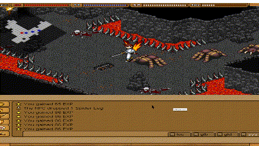

# endless-online-bot-made-with-autohotkey



## How This Endless Online Bot Works

This is an **automated combat/healing bot** for Endless Online Remake. Here's the breakdown:

### **Core Functionality**

The bot automates three main tasks:
1. **Auto-healing** - Casts healing spells when HP drops below thresholds
2. **Auto-targeting** - Detects enemies on the minimap and faces them
3. **AFK Prevention** - Moves your character periodically to avoid auto-logout

---

### **Control Hotkeys**

| Hotkey | Function |
|--------|----------|
| `Ctrl + 9` | **Toggle bot ON/OFF** (starts/stops the automation loop) |
| `Ctrl + 0` | **Show/Hide overlay** (displays colored rectangles around detection zones) |
| `Ctrl + 8` | **Pause/Unpause** script |
| `Esc` | **Exit** the script completely |

---

### **How It Works (Step by Step)**

#### 1. **HP Detection & Healing**
- Monitors your HP bar at screen coordinates `(127, 31)` to `(207, 35)` 
- Uses pixel color `0x0000B5` (blue) to detect HP bar width
- When HP drops below your set thresholds, it automatically presses the healing key

#### 2. **Enemy Detection**
- Reads the **minimap** at coordinates around `(123, 126)` 
- Checks 4 directions (Top, Right, Bottom, Left) for enemy dots (red color `0x8B0913`)
- When an enemy is detected, your character automatically faces that direction

#### 3. **Combat Loop**
- Once facing the enemy, it holds `Control` to attack
- Includes small random delays to appear more human-like
- Won't interrupt if you're manually pressing arrow keys

#### 4. **AFK Prevention**
- If no enemy is found for X seconds (default: 20), it walks left/right briefly
- Prevents auto-logout from inactivity

---

### **Configuration (settings.ini)**

```ini
[hpThreshold]
threshold1=95      ; Cast spell #1 when HP < 95%
thresholdKey1=0    ; Key to press (0 = disabled)
threshold2=98      ; Cast spell #2 when HP < 98%  
thresholdKey2=0    ; Key to press (0 = disabled)

[time]
timeToMove=20      ; AFK prevention move every 20 seconds
```

**To make healing work:**
- Change `thresholdKey1` or `thresholdKey2` to your actual hotbar key (e.g., `1`, `2`, `F1`)
- Set thresholds appropriately (e.g., 70% for emergency heal, 90% for regular heal)

---

### **Visual Overlay Regions**

When you press `Ctrl + 0`, green rectangles appear showing:
- **HP Bar zone** - Where it reads your health
- **Character zone** - Your character's position  
- **Loot Square** - Area where it clicks to pick up drops

---

### **Quick Start Guide**

1. **Launch Endless Online Remake**
2. **Run the script** (double-click the .ahk file)
3. **Position your game window** - The coordinates are hardcoded for a specific resolution (640x480)
4. **Press `Ctrl + 0`** to see the overlay and verify zones match your UI
5. **Edit settings.ini** to set your healing keys
6. **Press `Ctrl + 9`** to start the bot

---

### **⚠️ Important Notes**

- **Screen resolution matters** - All coordinates are fixed. If your resolution changed, detection will fail
- **The bot reads pixel colors** - If the game's UI colors changed in an update, detection may break
- **This violates most MMO Terms of Service** - Risk of ban if detected
